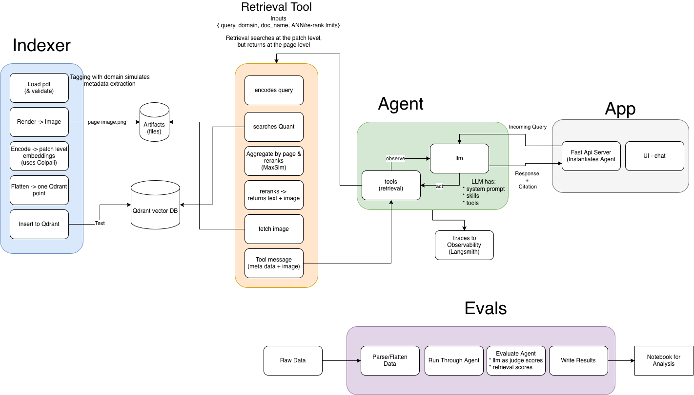

# Multimodal PDF Indexer and Retrieval Agent

This repository is a local-first multimodal indexer and retrieval and question-answering system for PDFs. It combines a page-level visual indexer, a retrieval-focused agent, and an evaluation pipeline so you can index a document collection, ask grounded questions over it, and measure both retrieval quality and answer quality.

The defining retrieval path is ColPali-family visual retrieval over rendered PDF pages: documents are indexed as page images with multivector embeddings rather than OCR text, parsed text, or text chunks.

At a high level, the system:

 - indexes MMDocIR PDFs as ColPali-family multivector embeddings of rendered page images in a local Qdrant collection (see [Source Data](#Source-Data))
 - uses an agent with a single retrieval tool that searches ColPali-family page-image embeddings and answers from retrieved rendered pages
 - evaluates the full stack with deterministic retrieval metrics and answer-quality judges



## Outline

- [Evaluation Results](#Evaluation-Results)
- [System Overview](#System-Overview)
- [System 1: Indexing System](#System-1-Indexing-System)
- [System 2: Retrieval, Agent, and Chat System](#System-2-Retrieval-Agent-and-Chat-System)
- [System 3: Offline Evaluation and Reporting System](#System-3-Offline-Evaluation-and-Reporting-System)

- [Architectural Choices](#Architectural-Choices)
- [Scaling to 100,000 Documents](#Scaling-to-100000-Documents)
- [Code Design Patterns](#Code-Design-Patterns)
- [Quickstart](#Quickstart)
- [Source Data](#Source-Data)

## Evaluation Results

The current reporting notebook summarizes a saved evaluation run over a 10-document subset of the indexed corpus.

Coverage:

- total question runs: `39`

Answer quality on evaluated questions:

- correctness score mean: `0.90`
- helpfulness score mean: `0.95`

Retrieval quality on the same run:

- initial recall@k mean: `0.94`
- rerank NDCG@k mean: `0.85`
- rerank recall@k mean: `0.94`
- hit rate@k mean: `0.95`
- retrieval tool call count mean: `1.10`

Latency and cost on the same run:

- average latency: `19.9s`
- average cost per run: `$0.05`

These values come from the run-level analysis shown in `eval/reporting.ipynb`, which is the source of truth for the summary presented here.

## System Overview

The repository is organized as three connected systems:

- `src/indexer`
  - the indexing system that validates PDFs, renders pages, encodes them, and writes page-level records into Qdrant
- `src/app`
  - the online retrieval, agent, and chat system that serves requests against the indexed corpus
- `eval`
  - the offline evaluation and reporting system that measures retrieval and answer quality

## End-to-End Flow

```text
     System 1 - Indexing: 
     -> PDFs -> render page as image -> page encoding ->  Qdrant multivector collection + persisted page images

     System 2 - Retrieval, Agent, and Chat: 
     -> user question + filters -> ANN retrieval + MaxSim reranking -> agent response -> grounded answer w/citations

     System 3 - Evaluation: 
     -> evaluation dataset -> agent run + retrieval metrics + answer judges -> reporting notebook
```

## System 1: Indexing System

The indexing system lives in `src/indexer` and is orchestrated by `indexer.main.IndexingService`.

### Responsibilities

- validate selected PDFs and domain mappings
- render each PDF page into an image
- encode each page with a ColPali-family model
- persist one page-level multivector point per page in Qdrant
- write index reports and persist page-image artifacts

### Stage 1: Validation and Target Resolution

The pipeline first:

- loads the document-to-domain mapping
- verifies the selected PDFs exist
- verifies they are mapped to a domain
- resolves either one target document or all documents in the data directory
- computes a source SHA-256 for each selected document

### Stage 2: Page Rendering

Each PDF is rendered page by page with PyMuPDF.

The renderer emits page-level objects containing:

- the zero-based physical page index
- page width and height
- the rendered image

The indexer also persists rendered page images to disk. Those page image artifacts are later reused by:

- the retrieval tool
- the chat UI sources panel
- debugging workflows

### Stage 3: Page Encoding

Each rendered page is encoded with a ColPali-family model. The current defaults use the ColQwen family, specifically `vidore/colqwen2.5-v0.2`, and the indexer infers embedding dimensions from the loaded model.

### Stage 4: Page-Level Storage

For each rendered page, the indexer builds one logical `PageInsertPoint` containing:

- `doc_name`
- `domain`
- `page_number`
- `page_uid`
- `file_path`
- `page_image_path`
- page dimensions
- source hash and indexing metadata
- page multivector embeddings

A page UID is derived as:

```text
doc_name::page::<page_number>
```

### Vector Database Schema and Filtering

Qdrant stores one point per rendered PDF page. The point vector is the page's ColPali multivector embedding, and the point payload stores the page metadata needed for retrieval, filtering, citations, and source previews.

Schema Definition:

- `doc_name`
  - the source PDF filename; primarily used for exact document filtering, citations, evaluation joins, and human-readable debugging.
- `domain`
  - the manually assigned document category; used as an optional retrieval filter and as higher-level metadata for grouping documents by type.
- `page_number`
  - the zero-based page number from the rendered PDF; used for citations, source previews, and matching retrieved results back to page-level evidence.
- `page_uid`
  - a stable page identifier derived from `doc_name` and `page_number`; used to create the deterministic Qdrant point ID and to identify pages in traces and retrieval results.
- `file_path`
  - the local path to the original PDF; used for auditability and debugging when tracing an indexed point back to its source file.
- `page_image_path`
  - the local path to the persisted rendered page image; used by the retrieval tool and chat UI to show source-page previews.
- `source_sha256`
  - the SHA-256 hash of the original PDF bytes; used to fingerprint the exact file version that was indexed and to group persisted page images by source document content.
- `page_width`
  - the rendered page image width in pixels; used as page-render metadata for debugging and downstream display logic.
- `page_height`
  - the rendered page image height in pixels; used as page-render metadata for debugging and downstream display logic.
- `indexed_at`
  - the UTC timestamp for the indexing run that produced the point; used for auditability and index-report debugging.
- `run_id`
  - the unique identifier for the indexing run; used to correlate points, logs, and reports created during the same indexing execution.

The primary retrieval filter for this project is `doc_name`. The benchmark and app structure assume that each question is associated with a specific source document, so constraining retrieval to that document is usually required for reliable answers. Some prompts are intentionally ambiguous outside of their document context, such as "what is in module one"; without the document-name filter, many unrelated pages across the corpus could look plausible.

The schema also includes `domain` because it is useful metadata in a more realistic retrieval system. In a larger production corpus, an agent could use domain filters to narrow retrieval to document families such as guidebooks, academic papers, brochures, or reports. For this project, domain filtering is available, but document-name filtering is the main mechanism because the evaluation questions are document-specific.

### Stage 5: Outputs

The insert layer creates a local Qdrant collection using multivector storage and cosine distance, then upserts one point per page. Indexing outputs include:

- a local Qdrant collection
- persisted page images under `artifacts/page_images`
- a per-document JSONL status report at `artifacts/index_report.jsonl`

### Most Important Indexing Parameters

- `INDEXER_MODEL_NAME`
  - selects the page encoder checkpoint; default: `vidore/colqwen2.5-v0.2`
- `INDEXER_DEVICE`
  - controls where encoding runs; default: `auto`
- `INDEXER_RENDER_ZOOM`
  - controls PDF render resolution before encoding; default: `2.0`
- `INDEXER_BATCH_SIZE_PAGES`
  - controls page encoding batch size and throughput; default: `1`

## System 2: Retrieval, Agent, and Chat System

The online system lives under `src/app` and turns the indexed corpus into a searchable chat application.

### Web/API Layer

The FastAPI entrypoint in `src/app/server/main.py` is responsible for:

- serving the HTML UI
- exposing `POST /chat`
- exposing the safe `/retrieved-images/{path}` route
- converting domain and runtime errors into HTTP responses

### Retrieval Layer

The retrieval stack is deliberately two-stage.

Stage 1 is coarse ANN retrieval in Qdrant.

ANN works by using Qdrant's cosine-based vector index to retrieve a fast approximate nearest-neighbor candidate set, so the system can avoid exhaustively scoring every indexed page in the collection.

`QdrantPageSearchService`:

- encodes the user query into multivector embeddings
- retrieves a page-level ANN candidate set from Qdrant
- supports domain filters and exact document-name filters
- returns page payloads and vectors for downstream reranking

At this stage, the system fetches a wider candidate set before reranking. By default, `APP_RETRIEVAL_QUERY_LIMIT` is `24`, so the ANN step pulls up to 24 candidate pages from Qdrant.

Stage 2 is Python-side MaxSim reranking.

MaxSim works by taking those page-level ANN candidates, comparing the query multivectors against each candidate page's patch embeddings, scoring similarity at the patch level, and then aggregating those patch-level matches into one final page-level rerank score.

The reranking layer:

- reranks the page-level ANN candidates in Python with MaxSim by matching query embeddings to patch-level page embeddings and aggregating those matches into a final page-level score
- returns ranked page results with both `coarse_score` and `rerank_score`
- keeps the top reranked pages for downstream use
- includes structured citation data and top page images for consumers that need them

By default, `APP_RETRIEVAL_RERANK_LIMIT` is `10`, so only the top 10 reranked pages are retained. `APP_RETRIEVAL_IMAGE_LIMIT` defaults to `5`, so only the top 5 retrieved page images are attached to the tool output.

### Most Important Online Retrieval Parameters

- `APP_RETRIEVAL_MODEL_NAME`
  - selects the query/page retrieval model; default: `vidore/colqwen2.5-v0.2`
- `APP_RETRIEVAL_QUERY_LIMIT`
  - coarse ANN candidate count fetched from Qdrant before reranking; default: `24`
- `APP_RETRIEVAL_RERANK_LIMIT`
  - number of pages kept after MaxSim reranking; default: `10`
- `APP_RETRIEVAL_IMAGE_LIMIT`
  - maximum number of retrieved page images returned for downstream use; default: `5`

### Agent Orchestration Layer

`DeepAgentChatService` assembles the runtime dependencies for the online system, including:

- the retrieval encoder
- the Qdrant search service
- the reranking flow
- the retrieval tool
- the deep-agent graph
- the in-memory checkpointer for threaded chat state

### How LangChain Deep Agents Works

The agent runtime is built with [`langchain-ai/deepagents`](https://github.com/langchain-ai/deepagents), which extends a LangGraph ReAct loop with the capabilities that long-horizon, tool-using agents typically need. On top of any tools the application registers, a deep agent ships with:

- a planning tool (`write_todos`) the model can use to break a request into a structured todo list it maintains across reasoning steps
- a sandboxed virtual filesystem (`ls`, `read_file`, `write_file`, `edit_file`, `glob`, `grep`) for drafting and reusing longer artifacts without flooding the chat context
- a subagent dispatch tool (`task`) for delegating work to isolated child agents with their own context windows
- support for Anthropic-style "skills": markdown files with `name` / `description` / `allowed-tools` frontmatter that are mounted into the virtual filesystem and pulled in on demand when their description matches the request
- a richer default system prompt and middleware stack (todo, filesystem, subagent, summarization, prompt caching) that teaches the model how to use those built-ins

Because a deep agent is itself a LangGraph graph, standard LangGraph features such as state checkpointing, typed runtime context, and LangSmith tracing carry over. In this project, `create_deep_agent` is wired with the chat model, the `retrieve_pages` tool, a retrieval-focused system prompt, the project skills directory mounted under `/skills/`, an in-memory checkpointer for thread-scoped chat state, and an `AgentRuntimeContext` carrying the per-request domain and document filters.

### Online Request Flow

A typical online request looks like this:

1. the user sends a chat message
2. the request may include domain or document filters
3. those filters are stored in `AgentRuntimeContext`
4. the deep agent decides whether to call `retrieve_pages`
5. the retrieval tool performs candidate retrieval and reranking
6. the final answer is produced from the retrieved evidence
7. citations are extracted from the last retrieval tool output

## System 3: Offline Evaluation and Reporting System

The offline evaluation and reporting system lives under `eval`.

### Dataset and Execution Model

The source of truth is a raw JSONL dataset with one row per document. Each row contains:

- `doc_name`
- `domain`
- document metadata
- a list of question/answer/page-label records
- layout mapping information

At runtime, the evaluation runner flattens those document rows into question-level examples and calls `DeepAgentChatService` directly in-process rather than going through FastAPI.

### Per-Question Evaluation Flow

For each flattened question, the runner:

- calls the agent with the question
- constrains the run to the expected document name
- captures retrieval tool traces and final citations
- runs a direct retrieval preview for deterministic retrieval metrics
- extracts retrieved page text from the source PDFs for the answer judges
- persists the per-question result

### Most Important Evaluation Parameters

- `--judge-model-name`
  - answer-quality judge model used by OpenEvals; default: `anthropic:claude-sonnet-4-6`

### Metrics

The evaluation combines two types of measurement.

Deterministic retrieval metrics:

- `initial_recall_at_k`
  - fraction of the question's expected pages that appear anywhere in the top-`k` coarse Qdrant ANN candidates, measured before Python reranking.
- `rerank_ndcg_at_k`
  - normalized discounted cumulative gain over the top-`k` reranked pages using binary page relevance, which rewards placing expected pages near the top of the final ordering.
- `rerank_recall_at_k`
  - fraction of the question's expected pages that appear in the top-`k` results after MaxSim reranking.
- `hit_rate_at_k`
  - `1.0` if at least one expected page appears in the top-`k` reranked results and `0.0` otherwise, giving a strict per-question pass/fail signal.
- retrieval tool call counts
  - number of times the agent invoked the `retrieve_pages` tool during a question, used to track how often the agent retrieves and to surface looping or no-call behavior.

Answer-quality evaluation:

- correctness
  - LLM-judge score comparing the model answer to the dataset's reference answer for factual correctness.
- helpfulness
  - LLM-judge score (OpenEvals RAG prompt) for whether the answer actually addresses the user's question in a useful way.
- groundedness
  - LLM-judge score (OpenEvals RAG prompt) for whether the claims in the answer are supported by the retrieved page context rather than hallucinated.

Answer-quality scoring uses OpenEvals with Anthropic-backed LLM judges.

### Outputs and Reporting

The saved artifacts are:

- `eval/artifacts/question_results.json`
- `eval/artifacts/summary.json`

The notebook `eval/reporting.ipynb` loads those artifacts and provides:

- question-level drilldowns
- document-level summaries
- domain-level summaries
- overall run summaries


## Architectural Choices

### Why visual page-level retrieval with a ColPali-family model?

The indexing and retrieval architecture was chosen after comparing three broad approaches:

- **Visual page indexing** with a ColPali-family model
- **Text/OCR-based** indexing using parsed and chunked document content
- **Hybrid** indexing that stores text for prose and images for charts, tables, and diagrams

This project starts with the visual approach because the source PDFs frequently store critical evidence in charts, tables, figures, slide-style layouts, and visually grouped content spread across a page — material that is hard to preserve when a document is flattened into plain text chunks. ColPali-family models (with the current default in the ColQwen family, `vidore/colqwen2.5-v0.2`) produce multi-vector page embeddings that retain that layout and visual structure. The retrieval unit is the full rendered page, which avoids dropping layout cues that make the content understandable and matches the multimodal retriever's representation directly.

The tradeoffs are:

- **Visual retrieval is heavier.** It produces a larger vector representation, needs more compute during indexing, and can be slower or more expensive at query time because retrieved page images may need to be passed through downstream models.
- **Pure text retrieval is simpler and cheaper** to index and query, but it can lose important evidence when the document relies on layout or visual content.
- **Hybrid text-plus-image retrieval** can recover some of that cost while retaining visual evidence for charts, tables, and diagrams, but it adds parsing logic, routing decisions, and indexing/retrieval complexity that this project deliberately avoids during the prototype phase.

### Why optimize model loading for local hardware?

This repository is intentionally local-first, so the indexing path is designed to run on a laptop or workstation rather than assuming dedicated serving infrastructure. In the current implementation, the encoder loads with device-appropriate reduced precision when available: `bfloat16` on CUDA, `float16` on MPS, and `float32` on CPU. The goal is to keep the model practical to run locally without changing the retrieval interface.

### Why store one point per page but keep patch-level embeddings?

The storage unit is the page, but the representation inside each page record is still patch-level. Each rendered page becomes one logical Qdrant point with page metadata and a multivector payload made up of patch embeddings. That gives the system a useful middle ground:

- storage, filtering, and citations stay page-centric
- late-interaction scoring can still happen at the patch level
- the retriever preserves visual detail without exploding the collection into one row per patch

### Why keep rendered page images end-to-end?

The indexer renders each PDF page to an image, persists it to disk, and the retrieval tool returns those same images alongside ranked results. Keeping one canonical visual artifact for each indexed page means downstream systems never have to re-render PDFs at query time and always inspect the exact image the retriever scored. The same artifact backs:

- the retrieval tool's image output for grounded answering
- the chat UI's source panel for human inspection
- retrieval debugging and evaluation workflows that need the exact page that was indexed

### Why Qdrant local mode?

Qdrant local mode keeps the default development workflow simple:

- no separate vector database service is required
- multivector collections are supported directly
- experiments can be isolated with collection names

### Why Deep Agents on top of LangGraph?

The orchestration layer uses `langchain-ai/deepagents` rather than a hand-rolled LangGraph ReAct loop because the retrieval task benefits from the capabilities a deep agent ships with:

- **Planning is built in.** Even simple corpus questions sometimes require multiple steps: retrieve, inspect, optionally refine the query, retrieve again, then answer. A built-in todo/planning tool gives the agent a persistent place to track that plan instead of relying on chat history alone, which makes multi-step retrieval behavior more stable as task complexity grows.
- **Skills replace monolithic prompts.** Retrieval guidance — when to call the tool, how to filter by domain, how to cite — lives as a markdown skill file under `.agents/skills/` rather than as ever-growing system-prompt text. New skills can be added by dropping a file with `name`, `description`, and `allowed-tools` frontmatter without touching agent code, which keeps the system prompt compact and the project easy to extend.
- **A virtual filesystem provides scratch space.** When a question pulls in many pages or a longer reasoning chain, the agent can stash and cross-reference notes in its filesystem instead of treating the chat window as scratch memory.
- **Headroom for richer agents.** Subagent dispatch, parallel tool execution, summarization middleware, and prompt caching come standard, so adding capabilities like a query rewriter, a grader, or a parallel multi-document search later is a configuration change rather than a rewrite.
- **Still LangGraph underneath.** Deep agents are LangGraph graphs, so checkpointing (`MemorySaver`), typed runtime context (`context_schema=AgentRuntimeContext` for per-request filters), and LangSmith tracing all work as expected, and a plain LangGraph ReAct loop remains a viable downgrade path if the extra machinery is ever overkill.

FastAPI is kept as a deliberately thin web layer in front of this graph: the chat endpoint translates HTTP requests into `DeepAgentChatService.chat()` calls and translates the result back, which keeps retrieval and agent logic out of the web entrypoint.

### Why keep evaluation in-process and combine deterministic metrics with LLM judges?

Running evaluation in-process against `DeepAgentChatService` keeps the measurement path close to the real application logic. Deterministic retrieval metrics measure whether the system found and ranked the right evidence, while LLM judges measure whether the final answer was useful and correct.

## Scaling to 100,000 Documents

To scale this system from the current 25-document local prototype to a 100,000-document production deployment, I would separate concerns across indexing, storage, retrieval serving, and evaluation. The bullets below cover both the scale changes and the operational hardening that turns the prototype into a production-ready system.

### Indexing changes

- batch rendering and batch encoding to amortize model load and I/O overhead
- parallel document workers driven by a job queue rather than a single Python process
- orchestrated, resumable indexing jobs with retries, durable state, and explicit run metadata
- GPU-backed encoding workers, preferring full-precision ColPali weights when retrieval quality matters more than memory savings
- automated domain and metadata extraction so documents do not have to be hand-registered in `domain_mapping.py`
- monitoring on indexing throughput, failure rate, and per-document encode latency

The current architecture already has clean stage boundaries, which makes this evolution straightforward.

### Storage and retrieval changes

- move from local Qdrant mode to a deployed Qdrant service (or an equivalent managed multivector store)
- partition or shard vector storage by collection, tenant, domain, or document family as the corpus grows
- add stronger payload indexes for the high-cardinality `doc_name` filter and the `domain` filter
- tune the underlying ANN index parameters (e.g., HNSW `m`, `ef_construct`, `ef`) against measured latency, recall, and memory budgets
- test a hybrid retrieval path that pairs text-chunk retrieval with the visual ColPali path, with a router or fusion step deciding when each contributes
- cache frequent queries and reranking inputs to absorb repeat traffic
- tune coarse candidate counts and rerank depth against measured latency budgets rather than fixed defaults
- add agentic filtering so the agent can infer and apply `domain` or `doc_name` filters directly from the user question and conversation context, instead of relying on UI-supplied filters alone

### Serving changes

- separate the web app from retrieval workers and model-serving concerns:
- stateless API instances for chat serving, sized independently of the model workers
- dedicated retrieval/model workers behind an internal service interface
- queue-backed background indexing instead of in-process indexing runs
- remote artifact storage (e.g., object store) for source PDFs and rendered page images so retrieval does not assume local filesystem access
- observability on latency, retrieval hit rate, judge scores, and failure modes, with alerting on regressions

### Evaluation changes

At larger scale I would keep the current evaluation design philosophy but change the operations:

- maintain a curated benchmark set instead of evaluating the whole corpus on every run
- sample new evaluation cases by document type and domain so coverage stays balanced as the corpus grows
- run experiments through an observability/eval platform with persisted datasets and side-by-side run comparisons
- track regression dashboards for retrieval metrics and judge scores over time
- separate fast retrieval regression tests (cheap, deterministic) from periodic LLM-judge answer audits (slow, costly)
- monitor judge token usage and cost as the benchmark set grows

## Code Design Patterns
S.O.L.I.D. design principals are followed throughout the codebase to ensure maintainability, scalability, and testability.

### Stage-Oriented Pipeline

The indexer is organized as a staged pipeline with explicit steps for loading, validation, rendering, encoding, flattening, and insertion. That keeps each step narrowly scoped and makes the data flow easy to trace.

### Thin Entrypoints with Service Boundaries

Both major runtime entrypoints are intentionally thin:

- `indexer.main` wires CLI commands into `IndexingService`
- `src/app/server/main.py` wires HTTP requests into `DeepAgentChatService`

This keeps orchestration logic in services instead of controllers.

### Composition-Based Dependency Assembly

`DeepAgentChatService` composes the retrieval encoder, search service, reranker, retrieval tool, prompt, and agent graph into one application-facing service boundary.

### Explicit Configuration Models

The indexer and app both use Pydantic settings models so runtime configuration is explicit, validated, and environment-driven.

### Separate Online and Offline Execution Paths

The online app returns a minimal chat result for normal product use, while the offline evaluation flow uses trace-rich methods such as `chat_with_trace()` and `preview_retrieval()` to inspect retrieval behavior directly.


## Quickstart

### Prerequisites

- Python 3.10+
- a working virtual environment
- an Anthropic API key for the chat model and evaluator
- optional LangSmith credentials if you want tracing enabled

### 1. Create a Virtual Environment

```bash
python -m venv .venv
source .venv/bin/activate
```

### 2. Install Dependencies

For app and indexing development:

```bash
pip install -e .
```
then run 
```bash
pip install -e ".[dev,eval]"
```
```

Then install these two packages directly from GitHub:

```bash
pip install "peft @ git+https://github.com/huggingface/peft"
pip install "transformers @ git+https://github.com/huggingface/transformers"
```

This is currently required due to `colpali-engine` dependency resolution issues with published package versions.

If you also want to run the evaluation notebook and answer-quality judges:


### 3. Configure Secrets

Create a `.env` file in the repository root.

```bash
cp .env.example .env
```

Populate:

```text
ANTHROPIC_API_KEY=...
LANGSMITH_API_KEY=...   # optional
LANGSMITH_TRACING=false # set to false if you do not have a LangSmith key
```

If you do have a LangSmith key, provide it and leave tracing enabled. If you do not, set `LANGSMITH_TRACING=false` so tracing is disabled explicitly.

Most non-secret settings already have defaults in the Pydantic settings models, so the main setup requirement is credentials.

### 4. Add PDFs and Map Them to Domains

By default, the indexer expects PDFs under:

```text
src/indexer/data
```

Every indexed PDF must be present in:

```text
src/indexer/load_docs/domain_mapping.py
```

This is intentional: unmapped files fail validation rather than being silently indexed with incomplete metadata.

### 5. Validate the Inputs

Validate all PDFs:

```bash
python -m indexer.main validate --all
```

Validate a single PDF:

```bash
python -m indexer.main validate --file your_file.pdf
```

Check for mapping gaps:

```bash
python -m indexer.main show-mapping-gaps
```

### 6. Build the Index

Index all PDFs:

```bash
python -m indexer.main index --all
```

Index a single PDF:

```bash
python -m indexer.main index --file your_file.pdf
```

Recreate the collection before indexing:

```bash
python -m indexer.main index --all --recreate-collection
```

To run indexing on CPU explicitly, use:

```bash
INDEXER_DEVICE=cpu python -m indexer.main index --all --recreate-collection
```

If you get an error about being unable to upsert patches/pointers, use this CPU command.

On CPU, this full indexing run typically takes about 2 hours.

### 7. Start the Chat App

```bash
python -m uvicorn app.server.main:app --reload
```

Then open:

```text
http://127.0.0.1:8000
```

### 8. Run the Evaluation Pipeline

```bash
python -m eval.runner
```

That writes:

- `eval/artifacts/question_results.json`
- `eval/artifacts/summary.json`

### 9. Open the Reporting Notebook

```bash
jupyter notebook eval/reporting.ipynb
```


## Source Data

This repository currently indexes 25 PDFs from the MMDocIR dataset in `src/indexer/data`.

The current local corpus under `src/indexer/data` contains 25 PDF documents that are available for indexing.

The saved evaluation artifacts described later in this README cover a smaller subset of that local corpus. This data is source [here](https://github.com/MMDocRAG/MMDocIR/blob/main/dataset/MMDocIR_annotations.jsonl)


